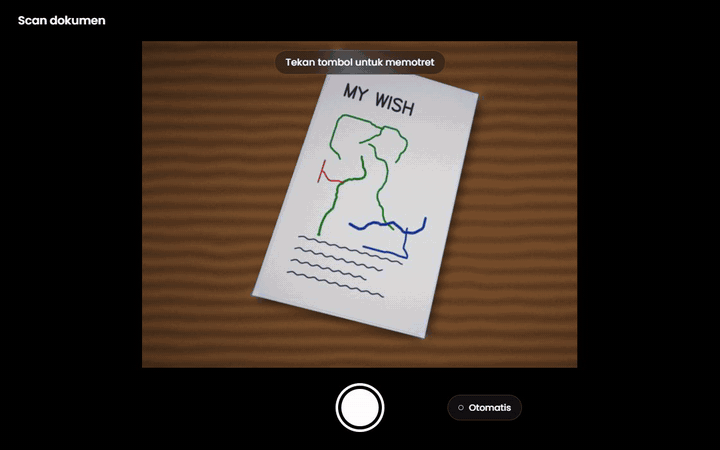

# Interface_scanner

Halaman scan dokumen untuk platform LOL Photobooth. Kamera mendeteksi kertas
secara langsung, lalu hasil fotonya dipotong dan diluruskan — yang tersisa
hanya kertasnya, rata seperti hasil mesin scan.



## Isi repo

| Berkas | Untuk apa |
| --- | --- |
| `SCAN.html` | **Halaman yang ditempel ke CMS.** Satu blok gaya, satu `<main>` (sintaks Angular), satu blok skrip. Styling memakai Bootstrap 5.3 yang sudah dimuat platform. |
| `preview.html` | Harness pengembangan (Angular → Vue), sama seperti di template Gemini. **Jangan diunggah ke platform.** |
| `index.html` | Pengalih ke `preview.html` (untuk GitHub Pages). |
| `test/` | Foto contoh untuk kamera tiruan. |
| `docs/demo-scan.gif` | Rekaman alur scan di atas. |

## Menjalankan

```bash
python -m http.server 5173
```

Lalu buka http://localhost:5173/preview.html — langsung memakai webcam.

| Query | Gunanya |
| --- | --- |
| `?fake=test/kartu-meja-kayu.jpg` | Kamera tiruan dari sebuah foto (laptop tanpa kamera, pengujian). Foto lain: `kartu-alas-gelap.jpg`, `kartu-meja-putih.jpg`, `kartu-tegak.jpg` (tegak, cocok untuk ukuran HP). |
| `&shake=2` | Besar goyangan tangan tiruan (px). |
| `&walk` | Kertas keluar-masuk frame tiap 10 detik. |
| `?IsUpload` | Tombol "Unggah foto" di layar kamera (sama dengan halaman Gemini). |
| `?noworker` | Menguji jalur cadangan: deteksi di thread utama. |

Kamera di HP hanya bisa dibuka lewat **https** (atau `localhost`). Untuk mencoba
di HP: aktifkan GitHub Pages untuk repo ini, atau langsung di platform.

Di console: `__state` (state halaman), `__SCAN` (mesin), `__SCAN_BUILD` (versi).

## Alur layar

```
kamera ──jepret──> hasil ──"Atur sudut"──> atur sudut ──> hasil
```

- **Kamera** — kertas dideteksi terus-menerus dan diberi efek cahaya. Jepret
  otomatis begitu kertas diam ±1,4 detik (bisa dimatikan lewat tombol
  "Otomatis"), atau tekan tombol jepret.
- **Hasil** — kertas yang sudah lurus. Tampilan: *Asli*, *Bersih* (bawaan:
  bayangan dan warna lampu dihilangkan, kertas jadi putih), *Hitam putih*.
  Ada *Putar*, *Atur sudut*, *Scan lagi*, *Simpan* (di HP membuka lembar
  bagikan, jadi bisa "Simpan gambar" ke galeri).
- **Atur sudut** — geser empat titik sudut (ada kaca pembesar). Muncul sendiri
  kalau kertas tidak ketemu sama sekali.

Tata letaknya menyesuaikan HP (tegak & miring), tablet, dan desktop: di HP
miring kontrol pindah ke sisi kanan; di layar lebar hasil dan panelnya
berdampingan.

## Efek cahaya scan

Bukan garis scan yang naik-turun, tapi "structured light" — cahaya yang
diproyeksikan ke permukaan kertas dan ikut miring bersama kertasnya:

1. **Kertas terdeteksi** — sekelilingnya meredup, kertas diselimuti cahaya biru
   dingin, kisi titik cahaya mekar dari tengah kertas, titik sudut "mengunci".
2. **Menunggu** — denyut cincin cahaya merambat dari tengah ke tepi.
3. **Ditahan** — cincin cahaya mengembang dari tengah; bagian yang sudah
   dilewati jadi bersih dan terang. Itulah progres jepret otomatis — tanpa bar
   atau cincin progres terpisah.
4. **Jepret** — kilau di kertas, lalu kertas yang sudah lurus "terangkat" dari
   foto dan mendarat di layar hasil.

Semuanya digambar di kanvas (`requestAnimationFrame`) dan Web Animations API,
karena animasi CSS `@keyframes` / `[ngStyle]` di dalam layar `*ngIf` terbukti
diam di platform. Kalau perangkat meminta animasi dikurangi
(`prefers-reduced-motion`), efeknya jadi statis dan transisinya dilewati.

## Cara kerja (hasil riset)

1. Frame kamera dikecilkan ke 384 px lalu dicari 4 sudut kertasnya dengan
   [scanic](https://github.com/marquaye/scanic) (MIT) memakai detektor ML
   DocCornerNet (~2 MB, diunduh sekali). Deteksinya berjalan di **Web Worker**,
   jadi animasi tetap 60 fps.
2. Saat jepret, deteksi diulang di foto resolusi penuh, lalu **sudutnya
   ditajamkan**: di sekitar tiap sisi dicari tepi kertas yang sebenarnya,
   ditarik garis lurus, dan garis-garisnya dipotongkan.
3. **Rasio asli kertas** ditebak dari perspektif foto (Zhang & He, 2007), jadi
   hasilnya tidak gepeng walau difoto miring. Bisa juga dikunci lewat
   `DOC_RATIO`.
4. Foto diluruskan (homografi + interpolasi bilinear), tepinya dipangkas 3 px
   supaya tidak ada garis sisa latar.
5. Filter *Bersih*: warna kertas diperkirakan per petak, lalu tiap piksel dibagi
   warna kertas di bawahnya.

### Perbandingan library

Diuji pada 24 foto: 15 foto asli dari repo scanic + 9 foto tiruan kondisi booth
(kartu di meja putih, meja kayu, meja berantakan, dipegang tangan, sudut
ekstrem, kartu kuning silau, kartu berbingkai cetak). Error = jarak sudut
terjauh dari posisi sebenarnya, dalam % diagonal foto.

| Metode | Pas (< 1%) | Meleset (1–2,5%) | Gagal | Waktu / frame | Unduhan |
| --- | --- | --- | --- | --- | --- |
| **scanic ML** (dipakai) | 19 | 2 | 3 | ~30 ms | ~2 MB model + 100 KB |
| jscanify (OpenCV.js) | 16 | 0 | 8 | ~70 ms | ~9 MB |
| scanic klasik (Canny) | 8 | 4 | 12 | ~110 ms | 100 KB |

- Penajaman sudut di atas scanic ML: median error 0,49% → 0,29%; pada kartu
  rata di meja 0,4–2,7% → sekitar 0,05%.
- Tebakan rasio kertas: median meleset 0,27% (2,8% kalau hanya memakai
  panjang sisi).
- Web Worker vs thread utama (desktop, 300 frame): frame tersendat > 50 ms
  turun dari 17 jadi 3.

Alternatif berbayar yang dicek: Dynamsoft (Mobile Web Capture / Document
Normalizer) dan Scanbot Web SDK — lebih lengkap dan ada dukungan, tapi
berlisensi. Google ML Kit Document Scanner (Android) dan VisionKit (iOS) hanya
untuk aplikasi native, bukan web.

### Supaya deteksi selalu kena saat acara

- Pakai **alas gelap atau kontras** di bawah kertas (matras hitam). Kertas
  putih di meja putih paling sulit.
- **Cahaya rata** — hindari lampu yang memantul langsung di kertas dan bayangan
  HP.
- Kertas **rata**. Kertas terlipat atau melengkung bisa menyisakan sedikit latar
  (bisa dibetulkan di *Atur sudut*).
- Jangan pegang kertas di sudutnya — jari menutupi sudut.
- Kalau kartunya dicetak sendiri, isi `DOC_RATIO` (mis. `4 / 6` untuk 4R) supaya
  rasio hasilnya persis.

## Konfigurasi

Semua ada di region **KONFIGURASI** paling atas di skrip `SCAN.html`.

| Nama | Isi |
| --- | --- |
| `BUILD` | Naikkan setiap kali berkas diubah, lalu cek `__SCAN_BUILD` di halaman live. |
| `SCANIC_URL`, `ML_OPTIONS` | Library deteksi. Untuk host sendiri: salin `dist/` scanic dan paket `scanic-ml` ke S3 (CORS `*`), lalu arahkan ke sana (`ML_OPTIONS.assetBaseUrl`). |
| `DOC_RATIO` | `"auto"` atau angka lebar / tinggi (`210 / 297` A4, `148 / 210` A5, `4 / 6` 4R). |
| `AUTO_CAPTURE_DEFAULT`, `HOLD_MS` | Jepret otomatis dan lama kertas harus diam. |
| `CAMERA_IDEAL` | Resolusi kamera yang diminta (bawaan 4K; browser memilih yang terdekat). |
| `OUTPUT_MAX`, `JPEG_QUALITY`, `DEFAULT_FILTER` | Ukuran, kualitas, dan tampilan awal hasil. |
| `ON_SCAN_READY` | Kait yang dipanggil setiap hasil siap — tempat mengirim hasil ke server, Gemini, atau cetak. |
| `this.copy`, `this.labels` | Semua tulisan di layar. |

## Aturan platform yang diikuti

Sama dengan template Gemini:

- Persis satu blok gaya, satu `<main>`, satu blok skrip; nama kedua tag itu
  tidak pernah ditulis utuh di komentar.
- Template Angular: `*ngIf`, `*ngFor`, `[ngClass]`, `[attr.*]`, `(click)`,
  `{{ }}`. Tanpa `ngModel`, `[class.x]`, atau `@if`.
- Semua `this.*` dipasang sinkron sebelum `await` pertama; state yang diubah dari
  callback async dibungkus `this.zone.run`.
- Semua class diawali `scn-`; Bootstrap dipakai lewat class dan variabel
  `--bs-btn-*`.
- Tidak ada teks status teknis di layar — diagnostik ke console.

## Belum ada / langkah berikutnya

- **Mode booth DSLR** (jembatan LOLBooth): foto Canon tinggal dilewatkan ke jalur
  yang sama dengan "Unggah foto" (deteksi → luruskan → hasil).
- **Unggah ke platform + QR**: sambungkan `ON_SCAN_READY` ke alur unggah dari
  template Gemini.
- **Host sendiri** scanic + model di S3 supaya tidak bergantung pada jsDelivr
  saat acara.
- Uji di perangkat sungguhan: iPhone (Safari), Android (Chrome), tablet booth.

## Lisensi pihak ketiga

[scanic](https://github.com/marquaye/scanic) (MIT) dimuat dari jsDelivr saat
halaman dibuka; model DocCornerNet-nya juga MIT.
