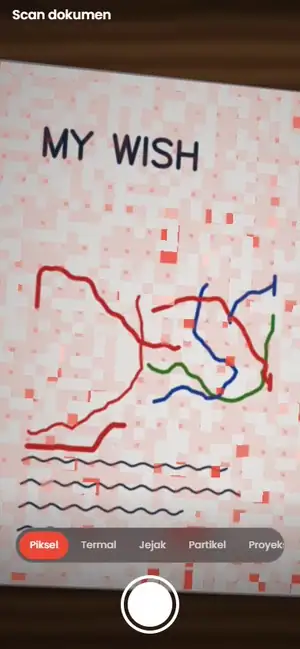
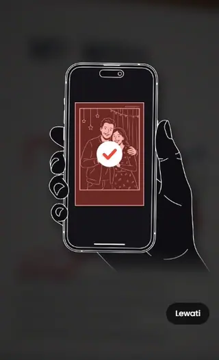

# Interface_scanner

Halaman scan dokumen untuk platform LOL Photobooth. Kamera mendeteksi kertas
secara langsung dan memberi animasi "sedang di-scan" yang menempel di permukaan
kertas. Hasil fotonya nanti dipotong dan diluruskan — yang tersisa hanya
kertasnya, rata seperti hasil mesin scan.

> **Tahap sekarang: fokus ke animasi scan.** Jepret sengaja dimatikan
> (`CAPTURE_ENABLED = false`), dan ada beberapa pilihan motion untuk
> dibandingkan langsung di HP.




Versi video motion: [docs/demo-motions.mp4](docs/demo-motions.mp4).

## Isi repo

| Berkas | Untuk apa |
| --- | --- |
| `SCAN.html` | **Halaman yang ditempel ke CMS.** Satu blok gaya, satu `<main>` (sintaks Angular), satu blok skrip. Styling memakai Bootstrap 5.3 yang sudah dimuat platform. |
| `preview.html` | Harness pengembangan (Angular → Vue), sama seperti di template Gemini. **Jangan diunggah ke platform.** |
| `index.html` | Pengalih ke `preview.html` (untuk GitHub Pages). |
| `test/` | Foto contoh untuk kamera tiruan. |
| `docs/` | Rekaman pilihan motion (WebP animasi + MP4) dan tutorial. |

## Menjalankan

```bash
python -m http.server 5173
```

Lalu buka http://localhost:5173/preview.html — langsung memakai webcam.
Di HP: buka lewat GitHub Pages repo ini (kamera HP hanya bisa lewat **https**).

| Query | Gunanya |
| --- | --- |
| `?motion=termal` | Langsung membuka satu pilihan motion: `piksel`, `termal`, `jejak`, `partikel`, `proyeksi`. |
| `?fake=test/kartu-meja-kayu.jpg` | Kamera tiruan dari sebuah foto (laptop tanpa kamera, pengujian). Foto lain: `kartu-alas-gelap.jpg`, `kartu-meja-putih.jpg`, `kartu-tegak.jpg` (tegak, cocok untuk ukuran HP). |
| `&shake=2` | Besar goyangan tangan tiruan (px). |
| `&walk` | Kertas keluar-masuk frame tiap 10 detik. |
| `?capture` | Menyalakan alur jepret → hasil untuk dicoba, tanpa mengubah `CAPTURE_ENABLED`. |
| `?notutorial` | Tutorial tidak muncul saat halaman dibuka (untuk pengujian). |
| `?IsUpload` | Tombol "Unggah foto" di layar kamera (sama dengan halaman Gemini). |
| `?noworker` | Menguji jalur cadangan: deteksi di thread utama. |

Di console: `__state` (state halaman), `__SCAN` (mesin), `__SCAN_BUILD` (versi).

## Layar kamera

- Video **layar penuh** (tanpa bingkai hitam) di HP tegak/miring, tablet, dan
  desktop; judul, tombol lampu/ganti kamera, dan tombol jepret melayang di
  atasnya.
- Tidak ada teks petunjuk dan tidak ada garis tepi di sekeliling kertas:
  kertas yang terdeteksi ditandai **isian** cahaya, sekelilingnya sedikit
  diredupkan.
- Deret tombol di atas tombol jepret = **pilihan motion (sementara)**.
- Tombol **?** di pojok kanan bawah membuka lagi tutorial.

## Tutorial

Muncul begitu halaman dibuka (`TUTORIAL_ON_START`), di atas kamera yang
diredupkan dan diburamkan supaya fokus. Isinya animasi garis **tanpa teks**,
berulang terus (~5,4 detik per putaran):

1. kartu foto tergeletak (garisnya tergambar sendiri di putaran pertama);
2. HP masuk dari kanan bawah dan menyesuaikan posisi sampai kartu pas di
   layarnya — layarnya "tembus" memperlihatkan kartu di bawahnya;
3. kartu di layar menyala merah piksel demi piksel, lalu muncul centang;
4. HP pergi, ulang dari awal.

**Lewati** (kiri bawah) langsung menutupnya; tombol **?** membukanya lagi.
Animasinya digerakkan `requestAnimationFrame`, bukan CSS `@keyframes`.

> **Ilustrasi masih sementara.** Garis HP + kartu digambar di skrip (SVG).
> Berkas di `Tutorial/1x` (`Asset 3.png`, `Asset 4.png`) ternyata kosong —
> semua pikselnya putih dan tidak ada transparansi, jadi garisnya hilang
> waktu diekspor. Begitu diekspor ulang (paling bagus **SVG**, atau PNG dengan
> latar transparan), tinggal ganti isi `drawCard()` dan bagian HP di
> `buildTutorialArt()`; urutan animasinya tetap.

## Pilihan motion

Semua efek digambar satu shader WebGL yang memetakan tiap piksel layar balik
ke permukaan kertas (homografi), jadi animasinya menempel di kertas sungguhan
dan ikut miring. Hanya isian, satu warna: **`#ED4835`** (bagian paling terang
mendekati putih panas). Tiap kali kertas terdeteksi atau motion diganti,
isiannya "muncul" dulu: petak-petak kecil timbul acak dalam ~0,6 detik.

| Motion | Gerakannya |
| --- | --- |
| **Piksel** | Kertas dipecah jadi piksel yang menyala acak, berkelompok mengikuti medan yang bergeser; tiap ±5 detik semua piksel menyala serempak — momen kertas "terdigitalkan". |
| **Termal** | Medan panas yang mengalir pelan, dibagi beberapa tingkat isian seperti kamera termal. |
| **Jejak** | Dua titik cahaya menelusuri seluruh kertas (lintasan Lissajous) dan meninggalkan jejak yang memudar — seperti kepala pembaca. |
| **Partikel** | Kawanan partikel yang berkelip, sesekali berpusar merapat ke tengah lalu menyebar lagi. |
| **Proyeksi** | Matriks titik halftone yang ukurannya mengikuti interferensi dua gelombang — seperti cahaya terstruktur pada mesin scan 3D. |

Setelah satu dipilih: isi `MOTION_DEFAULT` di skrip dengan key-nya, lalu hapus
`div.scn-motions` di markup. Shader untuk motion yang tidak dipakai boleh ikut
dihapus (fungsi `fx…` di `LIGHT_FRAG`).

Kalau perangkat meminta animasi dikurangi (`prefers-reduced-motion`), efeknya
berhenti di satu bingkai. Kalau WebGL tidak tersedia, kertas cukup diberi isian
warna polos.

## Alur lengkap (saat jepret dinyalakan lagi)

```
kamera ──jepret──> hasil ──"Atur sudut"──> atur sudut ──> hasil
```

- **Hasil** — kertas yang sudah lurus. Tampilan: *Asli*, *Bersih* (bawaan:
  bayangan dan warna lampu dihilangkan, kertas jadi putih), *Hitam putih*.
  Ada *Putar*, *Atur sudut*, *Scan lagi*, *Simpan* (di HP membuka lembar
  bagikan, jadi bisa "Simpan gambar" ke galeri).
- **Atur sudut** — geser empat titik sudut (ada kaca pembesar). Muncul sendiri
  kalau kertas tidak ketemu sama sekali.
- Saat jepret: kilau di kertas, lalu kertas yang sudah lurus "terangkat" dari
  foto dan mendarat di layar hasil.

## Cara kerja (hasil riset)

1. Frame kamera dikecilkan ke 384 px lalu dicari 4 sudut kertasnya dengan
   [scanic](https://github.com/marquaye/scanic) (MIT) memakai detektor ML
   DocCornerNet (~2 MB, diunduh sekali). Deteksinya berjalan di **Web Worker**,
   jadi animasi tetap mulus.
2. Saat jepret, deteksi diulang di foto resolusi penuh, lalu **sudutnya
   ditajamkan**: di sekitar tiap sisi dicari tepi kertas yang sebenarnya,
   ditarik garis lurus, dan garis-garisnya dipotongkan.
3. **Rasio asli kertas** ditebak dari perspektif foto (Zhang & He, 2007), jadi
   hasilnya tidak gepeng walau difoto miring. Bisa juga dikunci lewat
   `DOC_RATIO`.
4. Foto diluruskan (homografi + interpolasi bilinear), tepinya dipangkas 3 px
   supaya tidak ada garis sisa latar.
5. Filter *Bersih*: warna kertas diperkirakan per petak, lalu tiap piksel dibagi
   warna kertas di bawahnya.

### Perbandingan library

Diuji pada 24 foto: 15 foto asli dari repo scanic + 9 foto tiruan kondisi booth
(kartu di meja putih, meja kayu, meja berantakan, dipegang tangan, sudut
ekstrem, kartu kuning silau, kartu berbingkai cetak). Error = jarak sudut
terjauh dari posisi sebenarnya, dalam % diagonal foto.

| Metode | Pas (< 1%) | Meleset (1–2,5%) | Gagal | Waktu / frame | Unduhan |
| --- | --- | --- | --- | --- | --- |
| **scanic ML** (dipakai) | 19 | 2 | 3 | ~30 ms | ~2 MB model + 100 KB |
| jscanify (OpenCV.js) | 16 | 0 | 8 | ~70 ms | ~9 MB |
| scanic klasik (Canny) | 8 | 4 | 12 | ~110 ms | 100 KB |

- Penajaman sudut di atas scanic ML: median error 0,49% → 0,29%; pada kartu
  rata di meja 0,4–2,7% → sekitar 0,05%.
- Tebakan rasio kertas: median meleset 0,27% (2,8% kalau hanya memakai
  panjang sisi).
- Web Worker vs thread utama (desktop, 300 frame): frame tersendat > 50 ms
  turun dari 17 jadi 3.

Alternatif berbayar yang dicek: Dynamsoft (Mobile Web Capture / Document
Normalizer) dan Scanbot Web SDK — lebih lengkap dan ada dukungan, tapi
berlisensi. Google ML Kit Document Scanner (Android) dan VisionKit (iOS) hanya
untuk aplikasi native, bukan web.

### Supaya deteksi selalu kena saat acara

- Pakai **alas gelap atau kontras** di bawah kertas (matras hitam). Kertas
  putih di meja putih paling sulit.
- **Cahaya rata** — hindari lampu yang memantul langsung di kertas dan bayangan
  HP.
- Kertas **rata**. Kertas terlipat atau melengkung bisa menyisakan sedikit latar
  (bisa dibetulkan di *Atur sudut*).
- Jangan pegang kertas di sudutnya — jari menutupi sudut.
- Kalau kartunya dicetak sendiri, isi `DOC_RATIO` (mis. `4 / 6` untuk 4R) supaya
  rasio hasilnya persis.

## Konfigurasi

Semua ada di region **KONFIGURASI** paling atas di skrip `SCAN.html`.

| Nama | Isi |
| --- | --- |
| `BUILD` | Naikkan setiap kali berkas diubah, lalu cek `__SCAN_BUILD` di halaman live. |
| `ACCENT` | Warna cahaya scan dan aksen tombol pilihan (`#ED4835`). |
| `CAPTURE_ENABLED` | `false` = tombol jepret belum memotret (tahap animasi). |
| `TUTORIAL_ON_START` | Tutorial muncul saat halaman dibuka. |
| `MOTION_DEFAULT`, `this.motions` | Motion yang dipakai dan daftar pilihannya. |
| `SCANIC_URL`, `ML_OPTIONS` | Library deteksi. Untuk host sendiri: salin `dist/` scanic dan paket `scanic-ml` ke S3 (CORS `*`), lalu arahkan ke sana (`ML_OPTIONS.assetBaseUrl`). |
| `DOC_RATIO` | `"auto"` atau angka lebar / tinggi (`210 / 297` A4, `148 / 210` A5, `4 / 6` 4R). |
| `CAMERA_IDEAL` | Resolusi kamera yang diminta (bawaan 4K; browser memilih yang terdekat). |
| `OUTPUT_MAX`, `JPEG_QUALITY`, `DEFAULT_FILTER` | Ukuran, kualitas, dan tampilan awal hasil. |
| `ON_SCAN_READY` | Kait yang dipanggil setiap hasil siap — tempat mengirim hasil ke server, Gemini, atau cetak. |
| `this.copy`, `this.labels` | Semua tulisan di layar. |

Di region **Penyetelan**: `OUTSIDE_DIM` (gelapnya area di luar kertas) dan
`LIGHT_SCALE_MAX` (resolusi kanvas cahaya).

## Aturan platform yang diikuti

Sama dengan template Gemini:

- Persis satu blok gaya, satu `<main>`, satu blok skrip; nama kedua tag itu
  tidak pernah ditulis utuh di komentar.
- Template Angular: `*ngIf`, `*ngFor`, `[ngClass]`, `[attr.*]`, `(click)`,
  `{{ }}`. Tanpa `ngModel`, `[class.x]`, atau `@if`.
- Semua `this.*` dipasang sinkron sebelum `await` pertama; state yang diubah dari
  callback async dibungkus `this.zone.run`.
- Semua class diawali `scn-`; Bootstrap dipakai lewat class dan variabel
  `--bs-btn-*`.
- Animasi tidak memakai CSS `@keyframes` / `[ngStyle]` (terbukti diam di
  platform): cahaya scan digambar WebGL lewat `requestAnimationFrame`.

## Belum ada / langkah berikutnya

- Pilih satu motion, lalu rancang reaksi saat kertas ditahan / dijepret untuk
  motion itu, dan nyalakan lagi `CAPTURE_ENABLED`.
- **Mode booth DSLR** (jembatan LOLBooth): foto Canon tinggal dilewatkan ke jalur
  yang sama dengan "Unggah foto" (deteksi → luruskan → hasil).
- **Unggah ke platform + QR**: sambungkan `ON_SCAN_READY` ke alur unggah dari
  template Gemini.
- **Host sendiri** scanic + model di S3 supaya tidak bergantung pada jsDelivr
  saat acara.

## Lisensi pihak ketiga

[scanic](https://github.com/marquaye/scanic) (MIT) dimuat dari jsDelivr saat
halaman dibuka; model DocCornerNet-nya juga MIT.
